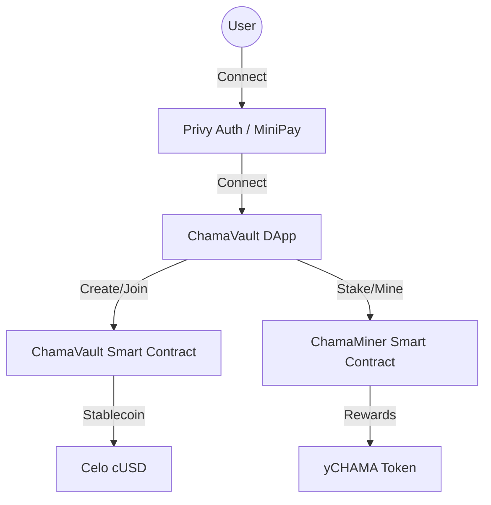

# 🏦 ChamaVault
**Decentralized Savings Circles — Built for Celo Proof of Ship**


> "Save Together, Grow Together."

ChamaVault digitizes Africa's centuries-old rotating savings tradition (Chama, Susu, Tontine) with blockchain-powered trust. By replacing middlemen with immutable smart contracts, we enable secure, transparent, and cross-border savings circles powered by Celo stablecoins.

---

## 🌟 The Vision
Traditional savings circles (Chamas) are the bedrock of community finance in Africa, yet they rely on absolute interpersonal trust. Funds are often managed manually, leading to mismanagement, lack of transparency, and zero credit-building potential.

**ChamaVault solves this by:**
- **Automating Trust:** Smart contracts enforce contribution schedules and automate payouts.
- **Removing Volatility:** All transactions use **cUSD**, ensuring savings maintain their value.
- **Building Reputation:** Every contribution builds an on-chain "Trust Score," creating a portable financial identity.
- **Yield Generation:** Integrated "Mining Rigs" allow idle funds to generate yield through our native protocol.

---

## 🚀 Core Features

### 🤝 Trustless Savings Circles
Deploy or join custom circles with immutable parameters:
- **Flexible Amounts:** Set contributions from 1 to 1000+ cUSD.
- **Custom Cadence:** Daily, Weekly, or Monthly rounds.
- **Transparency:** Real-time visibility into member contributions and upcoming payouts.

### ⛏️ ChamaMiner Rig
An innovative gamified staking protocol:
- **Passive Yield:** Stake CHMT to mine **yCHAMA** tokens.
- **Hardware Upgrades:** Burn tokens to upgrade your rig (LITE 1.5x, PRO 3.0x).
- **Visual Feedback:** Interactive dashboard showing real-time yield accumulation.

### 🏆 Reputation & Leaderboards
- **On-Chain Identity:** Your savings habits are your resume.
- **Daily Quests:** Streak-based rewards for consistent ecosystem interaction.
- **Global Ranks:** Compete with the most reliable savers in the ecosystem.

---

## 🛠 Technology Stack
| Layer | Technologies |
| :--- | :--- |
| **Frontend** | Next.js 15+, React 19, Three.js (3D Logo) |
| **Blockchain** | Celo Mainnet / Alfajores |
| **Contracts** | Solidity, Hardhat, OpenZeppelin |
| **Web3** | Wagmi, Viem, Privy Auth |
| **Styling** | Vanilla CSS (Premium Glassmorphism Design) |

---

## 📐 System Architecture


---

## ⚙️ Quick Start

### 1. Installation
```bash
git clone https://github.com/Earnwithalee7890/ChamaVault.git
cd chamavault
npm install
```

### 2. Configuration
Copy `.env.example` to `.env` and fill in your details:
```bash
cp .env.example .env
```

### 3. Development
```bash
npm run dev
```

---

## 📜 Smart Contract Deployment & Verification (Celo Mainnet)

To qualify for the **Proof of Ship** campaign, contracts must be deployed to Celo Mainnet and verified on Celoscan:

1. **Deploy to Celo Mainnet:**
   ```bash
   npx hardhat run scripts/deploy.js --network celo
   ```
2. **Verify Contracts:**
   ```bash
   npx hardhat verify --network celo <DEPLOYED_CONTRACT_ADDRESS> [CONSTRUCTOR_ARGUMENTS]
   ```
3. **Configure Environment:**
   Fill in the verified addresses in your `.env` file under the respective fields (`NEXT_PUBLIC_CONTRACT_ADDRESS`, etc.) to sync them with your frontend.

---

## 🏆 Celo Proof of Ship
ChamaVault is designed to showcase the power of Celo's mobile-first, stable-asset ecosystem. By combining culturally relevant financial practices with cutting-edge DeFi primitives, we are building the future of community finance.

Built with ❤️ by the ChamaVault Team.
